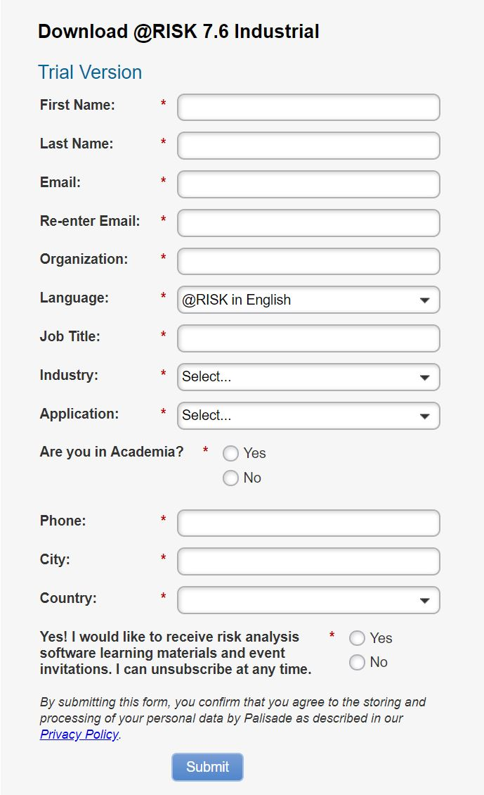
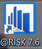
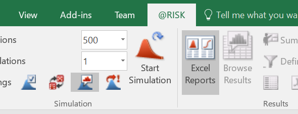

# Tutorials for ISE 3424 2019 Spring
## Content
1. [ How to download free trial of @Risk? ](#t1)
2. [ How to begin with @Risk? ](#t2)

## How to download free version of @Risk?
`15 day's free trial`

1. Open @Risk official website in browser. [Click here to open link](https://www.palisade.com/risk/default.asp)
2. Click on `Free Trial` to download the software.

3. Fill in the form to start downloading. 

4. Install the downloaded software on your laptop/desktop.
---

## How to begin with @Risk?
>`Windows operation system required`
1. Double click on the @Risk application. 

2. You will see a tag named `@RISK` in Excel.

3. In this opened Excel, click on: `File -> Open -> Browse` and select `1InitialRiskLab.xls` for Lab1.
4. Play with Lab1. :)
